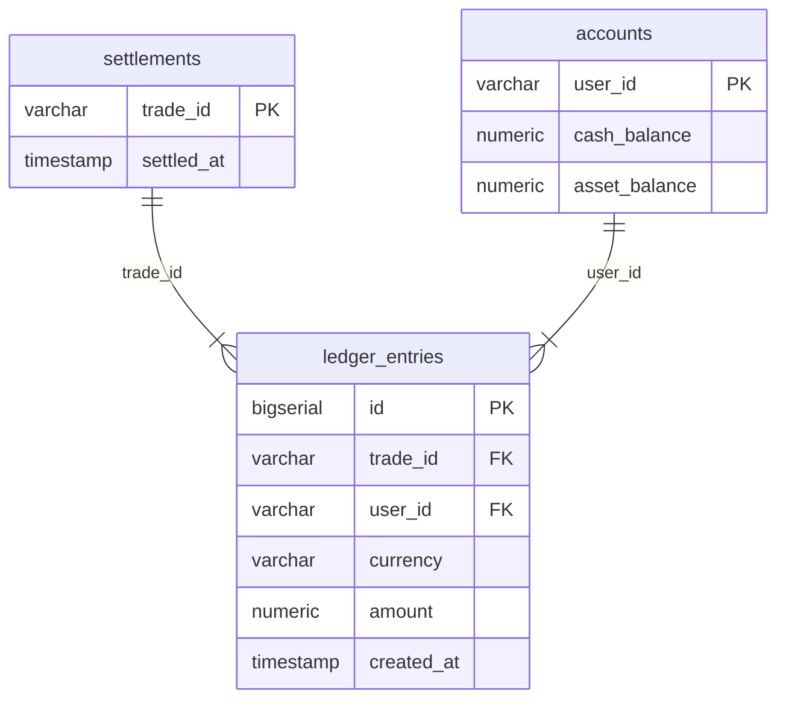

# TradeCore — Part B: Ledger & Settlement Module

TradeCore is a high-performance prototype trading exchange backend built with Java 17+, Spring Boot 3, and PostgreSQL.

This module encapsulates **Part B: Ledger & Settlement**, providing atomic, idempotent, double-entry trade settlement and auditable balance movements.

---

## 1. Architecture Overview

### Database Schema

The module manages three core tables in PostgreSQL:

1. **`accounts`**:
   - `user_id VARCHAR(64) PRIMARY KEY`
   - `cash_balance NUMERIC(20,8) NOT NULL CHECK (cash_balance >= 0)`
   - `asset_balance NUMERIC(20,8) NOT NULL CHECK (asset_balance >= 0)`
   - Stores current available balances. Database constraints strictly prohibit negative balances.

2. **`settlements`**:
   - `trade_id VARCHAR(64) PRIMARY KEY`
   - `settled_at TIMESTAMP WITH TIME ZONE NOT NULL`
   - Serves as the idempotency registry. Any trade successfully claimed in `settlements` is guaranteed to be processed exactly once.

3. **`ledger_entries`**:
   - `id BIGSERIAL PRIMARY KEY`
   - `trade_id VARCHAR(64) NOT NULL REFERENCES settlements(trade_id)`
   - `user_id VARCHAR(64) NOT NULL REFERENCES accounts(user_id)`
   - `currency VARCHAR(10) NOT NULL CHECK (currency IN ('USD', 'BTC'))`
   - `amount NUMERIC(20,8) NOT NULL` (signed financial movement)
   - `created_at TIMESTAMP WITH TIME ZONE NOT NULL`
   - An immutable, append-only double-entry ledger ensuring zero-sum conservation for every settlement.



---

## 2. Double-Entry Invariants & Sample Trade

For every executed trade, **four** signed ledger entries are created simultaneously:

1. Buyer USD Debit: `- (price * qty)`
2. Seller USD Credit: `+ (price * qty)`
3. Seller BTC Debit: `- qty`
4. Buyer BTC Credit: `+ qty`

### Mathematical Invariants
- For every trade:
  $$\sum \text{amount}_{\text{USD}} = 0$$
  $$\sum \text{amount}_{\text{BTC}} = 0$$
- Across the exchange:
  $$\text{Current Account Balance} = \text{Opening Balance} + \sum \text{Ledger Entries}$$

### Walkthrough Example:
- **Seed state:**
  - Alice: `USD 10,000`, `BTC 5`
  - Bob: `USD 2,000`, `BTC 10`
- **Trade:** Alice buys 2 BTC from Bob at $100 per BTC (Total = $200).
- **Post-trade balances:**
  - Alice: `USD 9,800`, `BTC 7`
  - Bob: `USD 2,200`, `BTC 8`
- **Ledger movements:**
  - Alice: `USD -200.00000000`
  - Bob: `USD +200.00000000`
  - Bob: `BTC -2.00000000`
  - Alice: `BTC +2.00000000`

---

## 3. Concurrency, Atomicity & Idempotency Safeguards

1. **Atomic Idempotency Claim (`ON CONFLICT DO NOTHING`)**:
   - `INSERT INTO settlements (trade_id, settled_at) VALUES (?, CURRENT_TIMESTAMP) ON CONFLICT (trade_id) DO NOTHING`
   - If the returned row count is 0, the trade was already processed. The method immediately exits returning `false` without locking accounts or mutating balances.

2. **Deterministic Row-Level Locking (`SELECT ... FOR UPDATE`)**:
   - To avoid race conditions and lost updates, account rows are selected with row-level locks.
   - To eliminate deadlocks between cross-trading parties, accounts are always locked in alphabetical order of their `user_id`:
     `min(buyerId, sellerId)` followed by `max(buyerId, sellerId)`.

3. **Atomic Unit of Work (`@Transactional`)**:
   - Balance checks, account debits/credits, settlement record, and ledger entries all run within a single transaction.
   - If an exception occurs (such as insufficient balance or account not found), the entire transaction rolls back completely, including the settlement record claim.

---

## 4. Local Development Setup

### Prerequisites
- Java 17+ (e.g. OpenJDK 17, 21, or JBR)
- Maven 3.8+
- Docker & Docker Compose (optional for local standalone database; integration tests run out-of-the-box with embedded PostgreSQL)

### Starting PostgreSQL with Docker Compose
A local development `docker-compose.yml` is provided.

```bash
docker compose up -d
```

> [!WARNING]
> Default credentials (`tradecore_user` / `dev_secret_password_unsuitable_for_prod`) are strictly intended for local prototype development and must never be used in production.

### Running Schema Migrations & Application
Schema migrations are handled automatically via Flyway upon application start.
Seed data for `alice` (USD 10,000 / BTC 5) and `bob` (USD 2,000 / BTC 10) is inserted idempotently on initial migration without overwriting existing balances on subsequent runs.

```bash
mvn clean spring-boot:run
```

### Running Automated Integration Tests
10 comprehensive PostgreSQL integration tests covering all failure and concurrency scenarios:

```bash
mvn test
```

---

## 5. Inspection SQL Queries

### Check Current Balances
```sql
SELECT user_id, cash_balance, asset_balance
FROM accounts
ORDER BY user_id;
```

### Check Settled Trades
```sql
SELECT trade_id, settled_at
FROM settlements
ORDER BY settled_at DESC;
```

### Check Double-Entry Audit Trail for a Trade
```sql
SELECT id, trade_id, user_id, currency, amount, created_at
FROM ledger_entries
WHERE trade_id = 'T-100'
ORDER BY id ASC;
```

### Verify Zero-Sum Invariant
```sql
SELECT trade_id, currency, SUM(amount) AS net_sum
FROM ledger_entries
GROUP BY trade_id, currency
HAVING SUM(amount) <> 0; -- Should always return 0 rows
```

### Reconcile Account Balances Against Ledger
```sql
SELECT
    a.user_id,
    a.cash_balance,
    COALESCE(SUM(CASE WHEN l.currency = 'USD' THEN l.amount ELSE 0 END), 0) AS net_usd_movement,
    a.asset_balance,
    COALESCE(SUM(CASE WHEN l.currency = 'BTC' THEN l.amount ELSE 0 END), 0) AS net_btc_movement
FROM accounts a
LEFT JOIN ledger_entries l ON a.user_id = l.user_id
GROUP BY a.user_id, a.cash_balance, a.asset_balance;
```

---

## 6. Known Prototype Limitations

- **Post-Match Settlement vs. Pre-Trade Fund Reservation**:
  In this prototype, settlement occurs after matching. Real-world financial exchanges hold/reserve funds and assets in an order risk layer prior to placing orders into the order book. In this prototype, if a user exhausts their balance in parallel between match and settlement, the settlement will fail and roll back.
- **Single-Node DB Lock Scaling**:
  Deterministic row locks (`SELECT ... FOR UPDATE`) guarantee consistency and eliminate deadlocks on a single database instance, but high trading volumes on hot accounts create contention. Production exchanges often employ partitioned in-memory sequencers (LMAX Disruptor pattern) prior to ledger write-backs.
- **Fixed Precision Scale**:
  `NUMERIC(20,8)` is configured for 8 decimal places (Satoshi precision). Additional fiat or altcoin asset types requiring 18 decimal places (e.g. Wei) would require configuring precision dynamically per asset currency.
